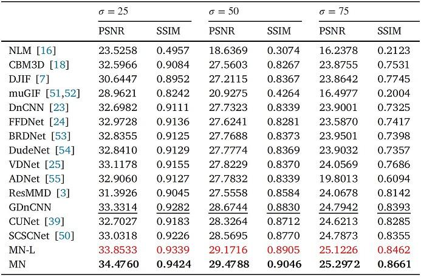

# [A model-driven network for guided image denoising](https://doi.org/10.1016/j.inffus.2022.03.006)

[Shuang Xu](https://shuangxu96.github.io/)^1, [Jiangshe Zhang](https:// ), [Jialin Wang](), Kai Sun, Chunxia Zhang, Junmin Liu, Junying Hu

##Test
----------
1. Download all the files from this [hyperlink](https://drive.google.com/drive/folders/1-BS3MSU8J9kLCjswoRbjo3i5e7BK2cSB?usp=sharing). 
2. Double-click `dataset.zip` to extract data.
3. Run [test_MN.py](test_MN.py) to reproduce the following tables. 

|||
|:---:|:---:|
|<i>(a) RNS </i>|<i>(b) FAIP</i>|

The table shows the evaluation results on RNS and FAIP. The 1st, 2nd and 3rd best values are marked by bold, red and underline, respectively.

##Pretrained weights
----------

|Model|# layers|# filters| Modality|
|---|:--:|:---:|:---:|
|[MN](https://drive.google.com/file/d/1Z3TowUKxoAQr9g-vZz_F4f-WdZI7M21j/view?usp=sharing)     | 7 | 64 |RGB-NIR|
|[MN](https://drive.google.com/file/d/1T8OqTrHlAakKoDl1ZcZJhIS4d1RUfBay/view?usp=sharing)     | 7 | 64 |Nonflash-Flash|
|[MN-L](https://drive.google.com/file/d/1NMDN_w8d0F2WdmpuqKgYycecas8_L9iH/view?usp=sharing)| 3 | 32  |RGB-NIR|
|[MN-L](https://drive.google.com/file/d/18Tjcz5QYrkY32HFG-QDLQY2UGz3YbqEp/view?usp=sharing)| 3 | 32  |Nonflash-Flash|
